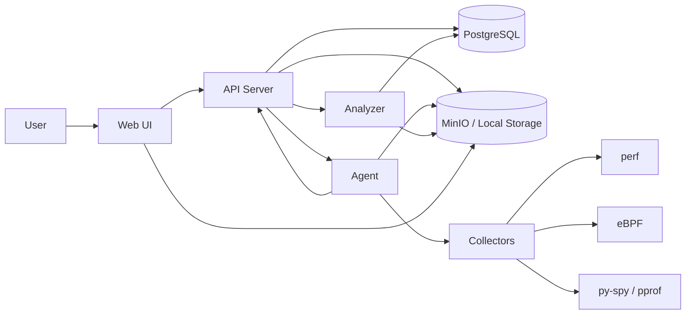

# 02. Architecture

## 总体架构

## 组件职责

### Web UI

职责：

- 展示 Agent 在线状态。
- 创建采样任务。
- 展示任务状态变化。
- 展示火焰图、热点函数、建议。

不负责：

- 不直接执行采集命令。
- 不直接访问系统进程。
- 不做复杂分析。

### API Server

职责：

- 提供 Web API。
- 管理任务、Agent、状态迁移、审计日志。
- 调度 Agent。
- 触发 Analyzer。
- 生成结果访问 URL。

关键原则：

- 所有状态变化必须落库。
- 所有失败必须有 reason。
- 对外返回稳定结构，不暴露内部命令细节。

### Agent

职责：

- 定期心跳。
- 接收任务。
- 调用采集器。
- 管理采集进程生命周期。
- 上传结果。
- 上报成功/失败。

关键原则：

- 心跳不能被采集任务阻塞。
- 采集命令必须有超时控制。
- 不使用 `system()` 拼 shell 命令。
- 采集失败要明确区分：PID 不存在、权限不足、命令失败、超时。

### Analyzer

职责：

- 从存储读取原始采集数据。
- 生成火焰图 SVG。
- 生成 TopN 热点 JSON。
- 生成规则建议或智能归因结果。
- 写回分析状态。

关键原则：

- Analyzer 是一次性任务，不是常驻服务。
- 输入输出契约要稳定。
- 同一任务重复分析时要幂等。

## 推荐技术栈

为了降低两周实现风险，建议技术栈先统一：

| 层 | 推荐 |
|---|---|
| Web UI | React + Vite + TypeScript |
| API Server | Go + Gin + GORM |
| Agent | Go 或 Python |
| Analyzer | Python |
| DB | PostgreSQL |
| Storage | MinIO，必要时本地目录降级 |
| Deploy | Docker Compose |

题目背景提到 C++，但 Mini 版如果允许自选语言，可以优先用 Go/Python 降低工程成本。若评审明确要求 C++ Agent，再把 Agent 部分切回 C++。

## API 草案

### Agent

- `GET /api/v1/agents`
- `POST /api/v1/agents/heartbeat`
- `GET /api/v1/agents/:id`

### Task

- `POST /api/v1/tasks`
- `GET /api/v1/tasks`
- `GET /api/v1/tasks/:id`
- `POST /api/v1/tasks/:id/cancel`
- `POST /api/v1/tasks/:id/retry`

### Analysis

- `POST /api/v1/tasks/:id/analyze`
- `GET /api/v1/tasks/:id/results`

### Audit

- `GET /api/v1/audit-logs`

## 数据表草案

### agents

- `id`
- `hostname`
- `ip`
- `version`
- `status`
- `last_heartbeat_at`
- `created_at`
- `updated_at`

### tasks

- `id`
- `target_pid`
- `target_agent_id`
- `sample_duration_sec`
- `sample_rate_hz`
- `collector_type`
- `status`
- `status_reason`
- `raw_artifact_path`
- `analysis_artifact_path`
- `created_at`
- `updated_at`
- `started_at`
- `finished_at`

### task_status_events

- `id`
- `task_id`
- `from_status`
- `to_status`
- `reason`
- `created_at`

### audit_logs

- `id`
- `entity_type`
- `entity_id`
- `action`
- `reason`
- `created_at`

### analysis_results

- `id`
- `task_id`
- `flamegraph_path`
- `topn_path`
- `summary`
- `created_at`

