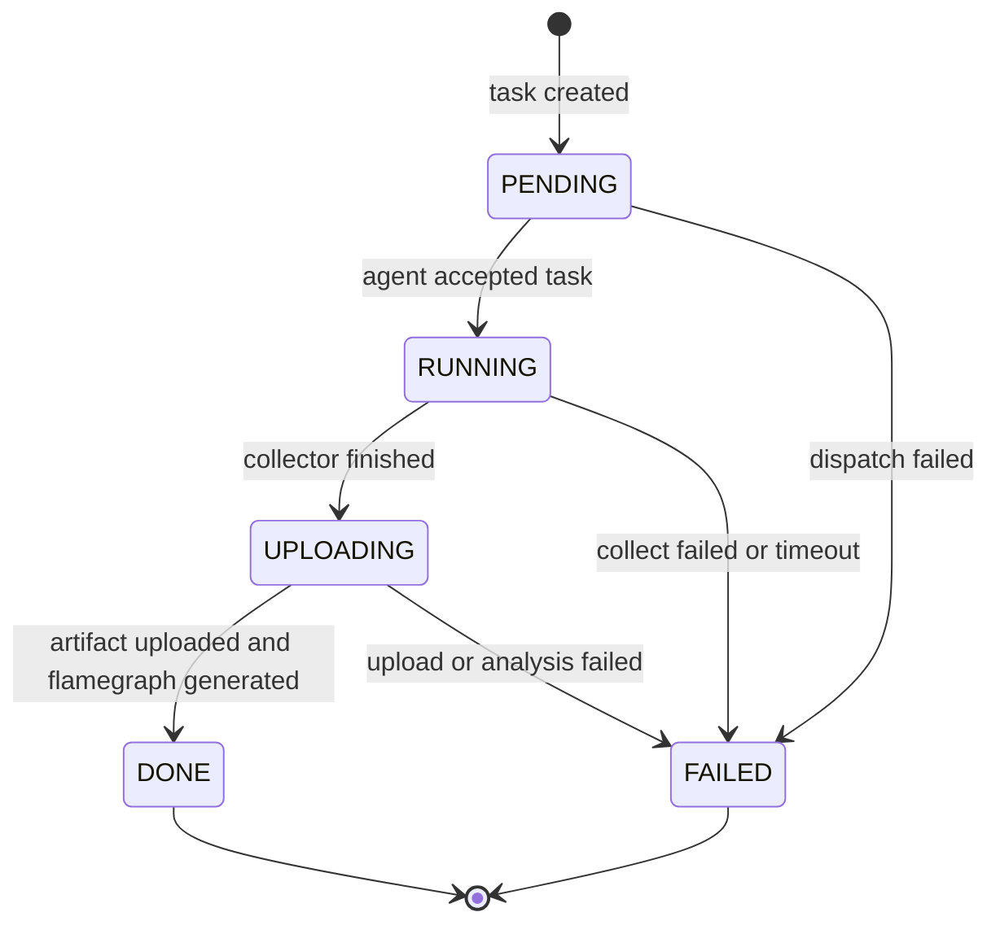
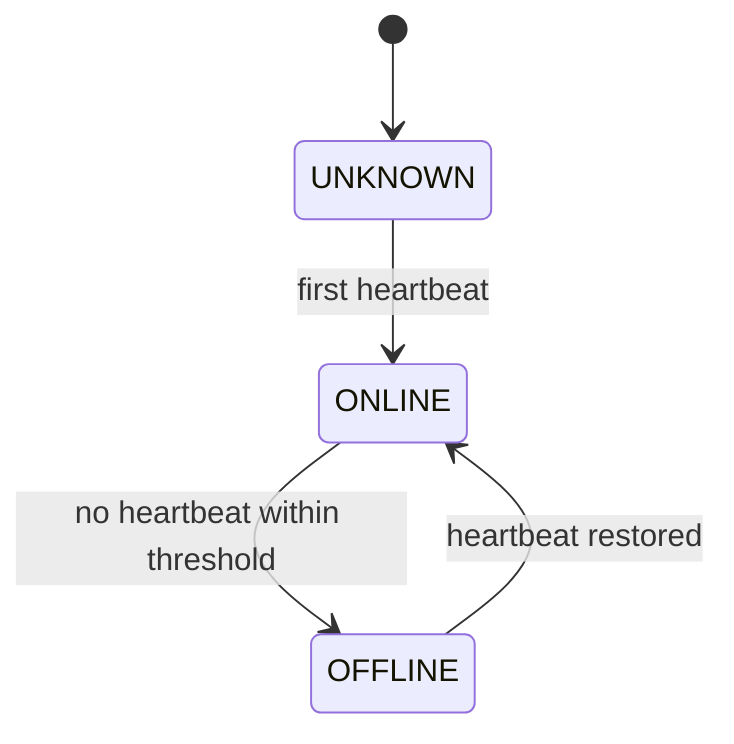

# 03. State Machines And Observability

## 任务状态机

Mini-Drop 的主状态只保留题目要求的五个值：

```text
PENDING -> RUNNING -> UPLOADING -> DONE / FAILED
```

状态细节不新增主状态，而是写入 `tasks.status_reason` 和
`task_status_events.reason`。这样 Web、API、Agent、Analyzer 都共享同一套状态语义。



## 状态迁移规则

每次状态迁移必须同时完成两件事：

1. 更新 `tasks.status` 和 `tasks.status_reason`。
2. 插入一条 `task_status_events` 记录。

当前实现使用服务层 helper 统一迁移，避免 handler 或 Agent 直接改状态字段。非法迁移会返回错误并保留原状态。

| From | To | Typical Reason |
|---|---|---|
| `PENDING` | `RUNNING` | `agent accepted task` |
| `RUNNING` | `UPLOADING` | `mock collector finished` / `perf record completed` |
| `UPLOADING` | `DONE` | `artifact uploaded and flamegraph generated` |
| `PENDING` | `FAILED` | `target agent offline` |
| `RUNNING` | `FAILED` | `target pid not found` |
| `RUNNING` | `FAILED` | `collector timeout after Ns` |
| `UPLOADING` | `FAILED` | `storage upload failed` / `analyzer failed` |

## Agent 状态机

Agent 状态由 API Server 根据心跳维护：



当前默认规则：

- Agent 每 5 秒发送一次 heartbeat。
- API Server 周期扫描 Agent。
- `last_heartbeat_at` 超过离线阈值后标记为 `OFFLINE`。
- `OFFLINE -> ONLINE` 和 `ONLINE -> OFFLINE` 都写入 `audit_logs`。
- Agent 离线时，未派发任务不会被该 Agent 领取；运行中任务可进入失败路径并保留 reason。

## 结构化日志

API Server、Agent、Analyzer 都输出结构化日志，便于演示失败路径时定位问题。推荐稳定字段：

- `timestamp`
- `level`
- `component`
- `trace_id`
- `task_id`
- `agent_id`
- `event`
- `message`
- `error`
- `duration_ms`

## 错误分类

### 用户输入错误

- PID 为空或小于 1。
- 采样时长超出范围。
- 采样频率超出范围。
- `collector_type` 不在允许列表。

### 环境错误

- `perf` 未安装。
- `perf_event_paranoid` 限制过高。
- 当前系统不是 Linux 却选择真实 Linux 采集器。
- `bpftrace` / `py-spy` 等采集器依赖缺失。
- MinIO / 本地 artifact 目录不可写。

### 运行错误

- 目标 PID 不存在。
- 采集命令非 0 退出。
- 采集超时。
- 上传或签名 URL 生成失败。
- Analyzer 生成 `flamegraph.svg` 或 `topn.json` 失败。

## Web 可观测性

Web 至少要能看到以下信息：

- Agent 在线/离线状态和最近心跳。
- 任务当前状态。
- 任务状态历史。
- 失败 reason。
- raw artifact、`flamegraph.svg`、`topn.json` 的路径或签名 URL。
- Analyzer 结果，包括火焰图、TopN、eBPF 分布、Python 栈、归因建议。
- Agent 离线/恢复审计日志。

## 演示重点

演示时按以下顺序展示可观测性：

1. 新建 mock 采样任务，观察 `PENDING -> RUNNING -> UPLOADING -> DONE`。
2. 打开任务详情，展示状态历史、火焰图、TopN、归因建议。
3. 创建无效 PID 任务，展示 `FAILED` 和清晰 reason。
4. 停掉 Agent 或运行 offline smoke，展示 Agent 离线审计日志。
5. 在 WSL2 / Linux 中选择 `perf`、`ebpf-syscall` 或 `py-spy`，展示真实采集器失败前置检查或成功结果。
