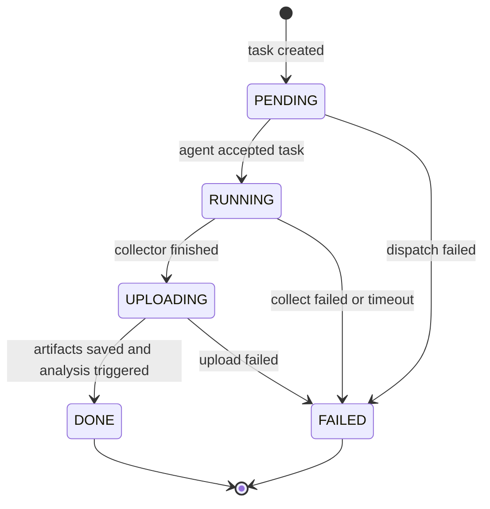
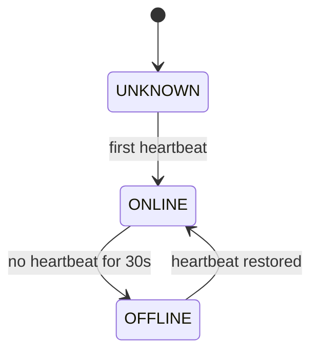

# 03. State Machines And Observability

## 任务状态机

题目明确要求：

`PENDING -> RUNNING -> UPLOADING -> DONE / FAILED`

我们按这个状态机实现，不随意增加主状态。需要更多细节时写进 reason 或 status event。

## 状态迁移规则

每次迁移必须写入两处：

1. 更新 `tasks.status` 和 `tasks.status_reason`。
2. 插入 `task_status_events`。

### 迁移样例

| From | To | Reason |
|---|---|---|
| `PENDING` | `RUNNING` | `agent accepted task` |
| `RUNNING` | `UPLOADING` | `perf record completed` |
| `UPLOADING` | `DONE` | `artifact uploaded and flamegraph generated` |
| `PENDING` | `FAILED` | `target agent offline` |
| `RUNNING` | `FAILED` | `target pid not found` |
| `RUNNING` | `FAILED` | `collector timeout after 30s` |
| `UPLOADING` | `FAILED` | `storage upload failed` |

## Agent 状态机

## Agent 心跳规则

- Agent 每 5 秒发送一次心跳。
- Server 每 10 秒扫描一次 Agent。
- 如果某 Agent `last_heartbeat_at` 超过 30 秒未更新，标记为 `OFFLINE`。
- 从 `ONLINE` 到 `OFFLINE` 必须写审计日志。
- 从 `OFFLINE` 到 `ONLINE` 必须写审计日志。

## 结构化日志

日志必须有稳定字段，便于排查演示失败。

推荐字段：

- `timestamp`
- `level`
- `component`
- `trace_id`
- `task_id`
- `agent_id`
- `event`
- `message`
- `error`
- `duration_ms`

## 错误分类

### 用户输入错误

- PID 为空。
- 采样时长非法。
- 采样率非法。

### 环境错误

- `perf` 不存在。
- 权限不足。
- `perf_event_paranoid` 限制。
- eBPF 依赖不存在。

### 运行错误

- PID 不存在。
- 采集命令退出非 0。
- 采集超时。
- 上传失败。
- Analyzer 生成火焰图失败。

## 可观测性最低要求

Web 上至少能看到：

- Agent 在线/离线。
- 当前任务状态。
- 状态变化历史。
- 失败原因。
- 火焰图结果路径。
- Analyzer 是否成功。

## 演示时重点展示

1. 新建任务后状态变化。
2. Agent 心跳在线。
3. PID 不存在时失败 reason 清楚。
4. Agent 离线时审计日志出现。
5. 正常路径最终展示火焰图。

