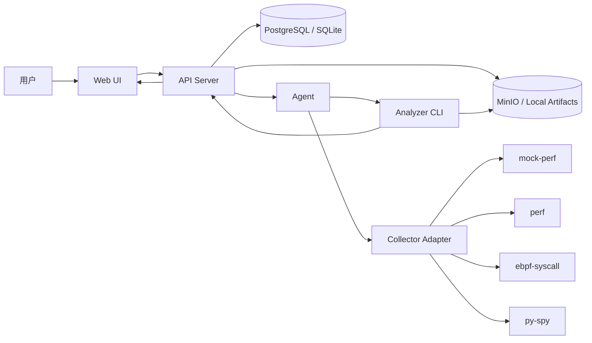

# Mini-Drop 项目考题回答文档

## 1. 项目目标回答

Mini-Drop 是对题目中 Drop 性能分析平台的二周版复刻。当前实现的核心目标是先保证一条稳定、可复现、可演示的端到端链路，再把真实 Linux 采集器、Continuous Profiling、多采集器可视化和智能归因接入同一套任务模型。

稳定演示链路如下：

```text
Web UI -> API Server -> Agent -> Collector -> Analyzer -> Storage -> Web UI
```

当前仓库已经包含：

- Web UI：React + Vite + TypeScript 控制台。
- API Server：Go + Gin + GORM，负责认证、任务、状态机、Agent、审计、结果和 AI 配置。
- Agent：Go 实现，负责 5s 心跳、领取任务、运行采集器、触发 Analyzer。
- Analyzer：Python CLI，负责把 raw artifact 转为 `flamegraph.svg`、`topn.json` 和资源时间线。
- 数据与制品：Docker Compose 下使用 PostgreSQL + MinIO；本地开发可使用 SQLite + 本地 artifacts。
- 一键启动：`docker compose` / `make demo` / PowerShell helper 均可启动。

## 2. 架构设计



组件职责：

| 组件 | 职责 | 关键边界 |
|---|---|---|
| Web UI | 创建任务、展示 Agent、状态历史、火焰图、TopN、连续计划、AI 建议 | 不直接执行系统命令 |
| API Server | 管理认证、任务状态机、Agent 心跳、审计日志、结果访问 URL、AI 配置 | 所有状态迁移必须落库 |
| Agent | 心跳、领取任务、运行采集器、写 raw artifact、触发 Analyzer | 采集失败必须给出明确 reason |
| Analyzer | 解析 mock/perf/eBPF/py-spy 产物，生成 Web 可展示结果 | 输入输出契约稳定 |
| Storage | 保存 raw 与 analysis artifact | Compose 使用 MinIO 签名 URL |

## 3. 基础能力逐项回答

| 题目要求 | 当前实现 | 验收方式 |
|---|---|---|
| Web UI 指定 PID、采样时长、采样率，通过 Server 下发任务 | Web 的“新建采样”和“快速接入”表单支持 `target_pid`、`sample_duration_sec`、`sample_rate_hz`、`collector_type`、目标 Agent | 浏览器创建任务；或 `python scripts\demo\smoke_compose.py --pid 1 --agent-id drop_agent` |
| Agent 采集、存储目标进程性能数据，通知 Analyzer | Agent 领取任务后按采集器写入 `artifacts/<task_id>/raw/`，随后调用 Analyzer 生成分析产物 | 成功任务中可下载 raw artifact，并看到 Analyzer 产物 |
| Analyzer 转成 Web 可展现格式 | Analyzer 生成 `flamegraph.svg`、`topn.json`、资源时间线；Web 展示火焰图、TopN、归因建议 | 任务详情页、文件分析页 |
| 状态机清晰，迁移落库并带 reason | 主状态固定为 `PENDING -> RUNNING -> UPLOADING -> DONE / FAILED`；`tasks.status_reason` 和 `task_status_events.reason` 双写 | 任务详情状态历史；单测覆盖非法迁移 |
| Agent 5s 心跳，Server 30s 离线，离线/恢复审计日志 | Agent 定时 heartbeat；Server 后台扫描离线；`audit_logs` 记录 offline/recovered | 机器列表、审计日志、`smoke-demo-offline` |
| 工程基线：结构化日志、显式错误、覆盖率、集成测试 | Go/Python 结构化日志；错误 reason 显式返回；覆盖率脚本和 smoke 脚本覆盖正常与异常路径 | `python scripts\demo\check_coverage.py`、`make final-preflight` |

## 4. 任务状态机回答

Mini-Drop 只使用题目要求的主状态，不额外引入中间主状态：

```text
PENDING -> RUNNING -> UPLOADING -> DONE
PENDING -> FAILED
RUNNING -> FAILED
UPLOADING -> FAILED
```

每次迁移统一写入：

- `tasks.status`
- `tasks.status_reason`
- `task_status_events.from_status`
- `task_status_events.to_status`
- `task_status_events.reason`

典型 reason：

| 迁移 | reason |
|---|---|
| `PENDING -> RUNNING` | `agent accepted task` |
| `RUNNING -> UPLOADING` | `mock collector finished` / `perf record completed` / `bpftrace syscall histogram completed` |
| `UPLOADING -> DONE` | `artifact uploaded and flamegraph generated` |
| `RUNNING -> FAILED` | `target pid not found` |
| `RUNNING -> FAILED` | `perf collector requires linux` |
| `RUNNING -> FAILED` | `perf_event_paranoid=N blocks process profiling` |
| `RUNNING -> FAILED` | `py-spy command not found` |

## 5. Docker Compose 一键启动回答

默认启动：

```powershell
.\scripts\demo\start-compose.ps1
```

默认访问：

- Web：<http://localhost>
- 登录：`demo / minidrop`
- API：<http://localhost:8080/healthz>
- MinIO Console：<http://localhost:9001>
- MinIO 登录：`minidrop / minidrop123`

端口被占用时使用备用端口：

```powershell
.\scripts\demo\start-compose.ps1 -ApiPort 18080 -WebPort 14173 -MinioPort 19000 -MinioConsolePort 19001
```

备用端口访问：

- Web：<http://localhost:14173>
- API：<http://localhost:18080/healthz>
- MinIO Console：<http://localhost:19001>

Compose 启动 5 个核心服务：

1. PostgreSQL
2. MinIO
3. API Server
4. Agent
5. Web

## 6. 扩展能力回答

### 6.1 Continuous Profiling

Continuous Profiling 已实现为“计划任务 -> 周期窗口 -> 普通任务”的复用架构。

关键点：

- Web `计划任务` 页面可创建连续剖析计划。
- 支持固定间隔、cron 表达式、错峰启动。
- 每个 5 分钟窗口 materialize 成普通 task。
- 窗口结果复用同一套 Agent、Analyzer、火焰图、TopN、AI 归因链路。
- Web 可查看窗口列表、完成率、失败原因、热点趋势和 baseline drift。

这样设计的原因是避免为 Continuous Profiling 复制一套独立任务模型，同时保证演示、审计、状态机和结果展示一致。

### 6.2 多采集器架构

当前采集器统一由 `collector_type` 分流：

| collector_type | 语义 | 当前实现 |
|---|---|---|
| `mock-perf` | 稳定演示采集器 | Windows / Docker Compose 默认路径，必过 |
| `perf` | Linux CPU 栈采集 | 执行 `perf record`，Analyzer 执行 `perf script` 并生成火焰图 |
| `ebpf-syscall` | eBPF 内核态 syscall 采集 | 通过 `bpftrace tracepoint:syscalls:sys_enter_*` 采集 syscall 分布 |
| `py-spy` | Python 用户态栈采集 | 调用 `py-spy` 采集 Python 进程用户态栈 |

真实采集器的环境限制：

- `perf`、`ebpf-syscall`、`py-spy` 必须在 Linux / WSL2 中验收。
- Windows Docker Desktop 演示默认走 `mock-perf`，避免被内核权限、ptrace、tracefs 和工具链阻塞。
- 真实采集器脚本会输出 `READY / BLOCKED / DONE / FAILED`，并给出下一条可执行修复命令。

真实采集器验收命令：

```bash
make real-preflight
make real-check
make real-smoke-report
COLLECTOR_TYPE=perf bash ./scripts/demo/start-local.sh
make smoke-real COLLECTOR_TYPE=perf
make smoke-real COLLECTOR_TYPE=ebpf-syscall
make smoke-real COLLECTOR_TYPE=py-spy
```

常见依赖修复：

```bash
sudo apt-get update
sudo apt-get install -y linux-tools-common linux-tools-generic bpftrace
python3 -m pip install --user py-spy
sudo sysctl kernel.perf_event_paranoid=1
sudo mount -t tracefs tracefs /sys/kernel/tracing 2>/dev/null || true
```

## 7. 智能归因回答

项目选择实现题目推荐的“智能归因”加分项。

当前归因链路分两层：

1. 规则归因：永远可用，基于 TopN、资源时间线、baseline 和工具轨迹生成可解释建议。
2. LLM 归因：可通过 Web `智能分析` 页面配置 OpenAI 兼容接口；配置 API Key 后，Server 将结构化证据发送给模型，要求返回严格 JSON。

LLM 输入边界：

- 任务元数据。
- TopN 热点。
- 规则归因结论与置信度。
- baseline evidence。
- resource timeline。
- tool trace。

LLM 约束：

- system prompt 要求只使用结构化证据，不虚构指标、文件、代码或业务背景。
- response format 使用 JSON object。
- 返回必须包含 `conclusion`、`confidence`、`recommendations`。
- 解析失败、HTTP 失败、超时或 Key 未配置时自动回退到规则归因。

Web 支持：

- `智能分析` 页面可配置 `Base URL`、`API Key`、`Model`、`Timeout`、`Max Tokens`。
- API Key 只保存，不明文回显。
- 任务详情页展示归因来源、置信度、建议和工具轨迹。

## 8. 工程质量回答

### 8.1 显式错误处理

采集器会区分：

- 非 Linux 环境。
- PID 不存在。
- 命令缺失。
- 权限不足。
- perf_event_paranoid 限制。
- tracefs / bpftrace 权限问题。
- py-spy attach 权限问题。
- 采集超时。
- Analyzer 失败。
- storage 上传失败。

这些错误都进入 `FAILED` 状态，并写入 `status_reason`。

### 8.2 结构化日志

API Server、Agent、Analyzer 都输出带 component、event、task_id、agent_id、duration、error 等字段的结构化日志，方便从任务 ID 追踪一次采集全过程。

### 8.3 覆盖率与测试

推荐验收命令：

```powershell
go test ./apps/api-server ./apps/agent ./internal/...
python -m unittest apps.analyzer.main_test
python scripts\demo\check_coverage.py
npm --prefix apps\web run build
```

Compose 正常路径：

```powershell
$env:MINIDROP_API_PORT='18080'
$env:MINIDROP_API_BASE_URL='http://127.0.0.1:18080'
$env:MINIDROP_MINIO_PORT='19000'
python scripts\demo\smoke_compose.py --pid 1 --agent-id drop_agent --expect-minio-url
```

Compose 异常路径 1，PID 不存在：

```powershell
$env:MINIDROP_API_PORT='18080'
$env:MINIDROP_API_BASE_URL='http://127.0.0.1:18080'
python scripts\demo\smoke_compose.py --pid 999999 --agent-id drop_agent --expect-status FAILED --expect-reason-contains "target pid not found"
```

Compose 异常路径 2，Agent 离线：

```powershell
make smoke-demo-offline
```

最终门禁：

```powershell
.\scripts\demo\final-preflight.ps1 -ApiPort 18080 -WebPort 14173 -MinioPort 19000 -MinioConsolePort 19001 -IncludeRealPreflight
```

## 9. 演示流程回答

15 分钟内建议按以下顺序演示：

1. 打开 Web 控制台，登录 `demo / minidrop`。
2. 展示首页 Agent 在线、任务统计和真实采集器 readiness。
3. 展示机器列表，确认 `drop_agent` 在线和最近心跳。
4. 新建 mock CPU 采样任务，PID 用 `1`。
5. 展示任务状态历史：`PENDING -> RUNNING -> UPLOADING -> DONE`。
6. 打开任务详情，展示火焰图、TopN、资源时间线和归因建议。
7. 打开文件分析页，展示 raw artifact、`flamegraph.svg`、`topn.json` 和 MinIO 签名 URL。
8. 创建 PID `999999` 的失败任务，展示 `FAILED` 和 `target pid not found`。
9. 打开计划任务页，展示 Continuous Profiling 的窗口、计划参数和趋势。
10. 打开智能分析页，展示 LLM 配置入口、API Key 不回显、规则兜底状态。
11. 如果在 WSL2/Linux，切换 `perf` / `ebpf-syscall` / `py-spy` 跑真实 smoke；如果在 Windows，展示 real preflight blocked 报告和修复命令。

## 10. 关键取舍

| 取舍 | 决策 | 原因 |
|---|---|---|
| 先 mock 再真实采集 | 先完成 mock vertical slice，再接 perf/eBPF/py-spy | 避免被 Linux 权限和工具链阻塞主流程 |
| Continuous Profiling 复用 task | 每个窗口 materialize 成普通任务 | 保持状态机、Analyzer、Web 展示一致 |
| 默认 Compose 用 mock-perf | Windows / Docker Desktop 默认不跑真实内核采集 | 保证评审 10 分钟内可复现 |
| 真实采集器放 WSL2/Linux 验收 | perf/eBPF/py-spy 需要 Linux 工具和权限 | 与题目真实采集要求一致 |
| LLM 可配置且可回退 | Web 配置 OpenAI 兼容接口，失败回退规则归因 | 既支持真实 AI，又保证 demo 稳定 |
| MinIO 签名 URL | Compose 下使用对象存储签名 URL | 更接近生产平台 artifact 访问模型 |

## 11. 当前完成度与边界

已完成：

- Web + API + Agent + Analyzer 多组件架构。
- Docker Compose 一键启动。
- 状态机、reason、事件历史。
- Agent 心跳、离线判定、审计日志。
- MinIO artifact 存储与签名 URL。
- mock-perf 稳定端到端演示。
- perf / ebpf-syscall / py-spy 采集器代码路径和 preflight/smoke 脚本。
- Continuous Profiling 窗口化任务链路。
- 规则归因与 OpenAI 兼容 LLM 配置入口。
- 覆盖率、单测、集成 smoke 和 final preflight。

需要在 Linux / WSL2 环境现场确认的部分：

- `perf` 是否可执行真实 `perf record`。
- `bpftrace` 是否具备 tracefs 与内核探针权限。
- `py-spy` 是否能 attach 到目标 Python 进程。

Windows Compose 环境中，这些真实采集器可以生成清晰的 `BLOCKED` 报告，但不作为 Windows mock 演示的阻塞项。

## 12. 如果再有 7 天

优先级从高到低：

1. 在干净 Ubuntu 22.04 / WSL2 中录制 `perf`、`ebpf-syscall`、`py-spy` 三条真实 smoke 视频证据。
2. 把 eBPF 从 `bpftrace` 原型升级为 libbpf-go 或 bcc，并增加固定 schema 的 syscall / scheduler / IO 事件。
3. 增加真实节点资源采集器，补齐 CPU、内存、IO wait、run queue 时间线，而不仅依赖 profile 样本推导。
4. 给 Continuous Profiling 增加 retention、rollup、任意 5 分钟窗口查询和跨窗口 diff。
5. 引入标准 FlameGraph Perl 工具作为默认渲染路径，内置 SVG 渲染保留为 fallback。
6. 为 LLM 归因增加工具调用协议和离线评测集，把“可验证”从 prompt 约束升级成工具执行约束。
7. 完善 RBAC、租户隔离和任务取消/重试能力。

## 13. 一句话总结

Mini-Drop 当前交付的是一套可复现的性能分析平台 demo：Windows Compose 路径保证 Web/API/Agent/Analyzer/MinIO 的稳定闭环，Linux/WSL2 路径承接真实 perf、eBPF 和 py-spy 采集器，所有任务状态、失败原因、审计日志、制品和归因结果都能在 Web 上被追踪和验证。
